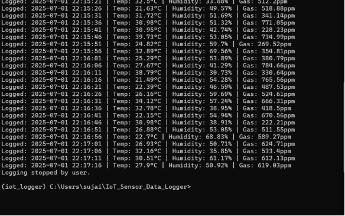
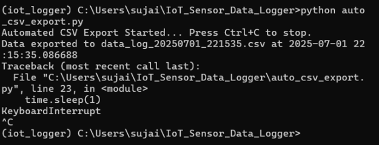
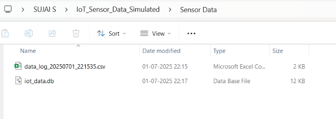
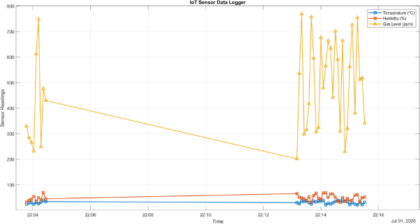

# IoT Sensor simulation using Python, SQLite, CSV, and MATLAB

## Aim:
This project demonstrates a complete IoT data logging system using simulated sensor data. The data is stored in a local SQLite database, automatically exported to CSV files, and finally visualised using MATLAB.

## The Project Flow:
- Simulated IoT sensors will generate random temperature, humidity, and gas levels.
- Python-based data logger will be storing the readings in a SQLite database.
- Automatically export CSV files at regular intervals.
- The data can be seen through MATLAB by plotting it.

## Steps Involved:

**Step 1: Database Setup**

We will be creating a local SQLite database that stores the incoming sensor data.

**Step 2: Sensor Data Logging**

Simulated sensor readings are continuously logged into the database. The system updates the database every few seconds with new temperature, humidity, and gas level values.

**Step 3: Automated CSV Export**

The logged data is automatically exported to CSV files at certain intervals.

**Step 4: CSV and Database Storage**

All exported CSV files are saved in the project folder alongside the SQLite database file.

**Step 5: MATLAB Visualisation of the Sensor’s Simulation**

The exported CSV files are used in MATLAB to plot the sensor data vs time. This helps in understanding the variations in temperature, humidity, and gas levels.

## Key Features:
- Simulated IoT sensor system so that, before using the actual sensor, one can simulate.
- Local database logging using SQLite, which is available in Python itself.
- CSV file is automatically exported.
- Visual analysis using MATLAB, where we plot the data vs Time.
- Flexible system that can later be connected to real hardware (like ESP32).

## Future Aspect:
Can create a GUI (Graphical User Interface) for different sensors, and we can use it for simulation before working with the actual sensor. Hence cost can be cut down drastically.
